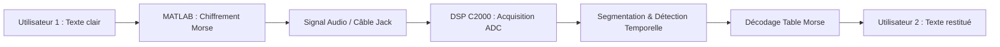

# DSP C2000 Acoustic Morse Decoder & Secure Audio Transceiver

[](https://github.com/)
[](https://www.ti.com/microcontrollers-mprocessors-dsp/c2000-real-time-control-mcus/overview.html)
[](https://www.ti.com/)

Système complet de communication et transmission d'information par modulation acoustique/audio et encodage Morse, implémenté sur microcontrôleur de traitement du signal **DSP Texas Instruments (C2000 / DSP28x)** et **MATLAB**.

---

## Problématique & Objectifs

La transmission de données en clair entre deux dispositifs (**A** et **B**) est vulnérable à l'interception par un tiers (**C**). L'objectif est de concevoir une chaîne de transmission sécurisée par encodage/modulation Morse :

* **Émetteur (Dispositif A)** : PC avec script MATLAB assurant le chiffrement du texte en signal modulé en fréquence (800 Hz) ou en créneau.
* **Récepteur (Dispositif B)** : Carte DSP C2000 assurant l'acquisition temps réel via ADC, le filtrage/détection des symboles et la restitution du texte en clair.

---

## Architecture & Principe de Fonctionnement




*Schéma de transmission audio entre PC (MATLAB) et DSP C2000.*

---

## Processus de Traitement (DSP & MATLAB)

### 1. Émission & Chiffrement (MATLAB)
1. **Saisie** du texte utilisateur.
2. **Encodage Morse** : Conversion des caractères en séquences de points (`.`), tirets (`-`) et espaces (`/`).
3. **Synthèse de signal** : Génération d'une porteuse audio à **800 Hz** ou d'un signal carré calibré avec respects stricts des ratios temporels ($1T$, $3T$, $7T$).


*Exemple de signal Morse généré côté émetteur.*

### 2. Réception & Déchiffrement (DSP C2000)
1. **Acquisition ADC** ($F_s = 44.1\text{ kHz}$) avec interruption temps réel.
2. **Détection d'énergie & seuillage** pour extraire les durées d'impulsions (haut/bas).
3. **Classification temporelle** :
   * Durée $\approx 100\text{ ms} \rightarrow$ **Point (`.`)**
   * Durée $\approx 300\text{ ms} \rightarrow$ **Tiret (`-`)**
   * Silence $\approx 300\text{ ms} \rightarrow$ Séparateur de lettre
   * Silence $\approx 700\text{ ms} \rightarrow$ Espace mot
4. **Reconstruction & Lookup** vers le texte ASCII final.


*Signal acquis et segmenté pour le décodage.*

---

## Méthodes de Transmission & Résultats

| Méthode | Support | Résultats & Limitations |
| :--- | :--- | :--- |
| **Acoustique (Micro / Haut-parleur)** | Onde sonore dans l'air | Sensible au bruit ambiant et aux échos. Rapport signal/bruit variable selon l'environnement acoustique. |
| **Filaire Directe (Câble Jack)** | Signal électrique (Jack $\rightarrow$ ADC) | **Haute fiabilité et zéro erreur**. Immunité quasi totale aux bruits parasites. |

---

## Structure du Répertoire

```text
├── c2000_firmware/
│   └── decoder_c2000.c       # Code C temps réel pour DSP C2000 (DSP28x)
├── matlab_transmitter/
│   └── morse_encoder.m       # Encodeur texte vers signal audio (MATLAB)
├── audio_samples/
│   └── amine_sample.wav      # Fichier audio de test pour validation
├── images/                   # Diagrammes et captures des signaux
└── README.md
```

---

## Démarrage Rapide

### 1. Génération du signal (MATLAB)
Exécuter `matlab_transmitter/morse_encoder.m`, saisir un texte et générer le signal sonore / export WAV.

### 2. Décodage sur la carte DSP (CCS)
Compiler `c2000_firmware/decoder_c2000.c` avec **Code Composer Studio** (projet DSP28x), flasher le DSP C2000 et injecter le signal sur l'entrée ADC.

---

## Contributeurs & Contexte

* **Amine Otmani**
* **Adam Ladjouzi**

**Date de réalisation :** Décembre 2024  
**Cadre :** Projet DSP / Systèmes Embarqués — **ENSTA**
